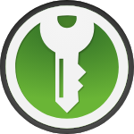
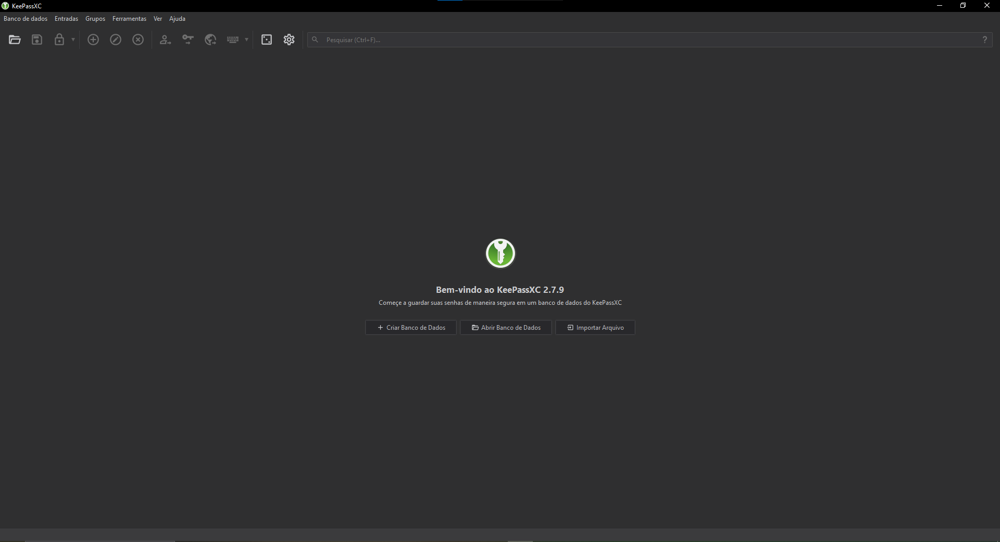
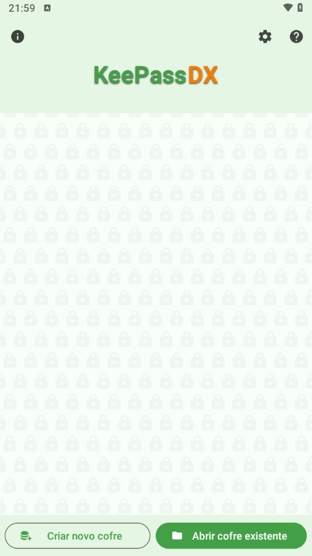

## KeePass

    

> Mobile: https://www.keepassdx.com

> PC: https://keepassxc.org

### O que é o KeePass?

O KeePass é um gerenciador de senhas gratuito e de código aberto que permite
armazenar senhas e outras informações sensíveis de forma segura em um banco de
dados criptografado. Ele foi desenvolvido para proteger suas credenciais contra
acessos não autorizados, utilizando algoritmos de criptografia avançados, como
**AES-256** e **ChaCha20**. Disponível para diversas plataformas, como desktop
(através do **KeePassXC**) e dispositivos móveis (através do **KeePassDx**), o
KeePass é amplamente utilizado devido à sua confiabilidade, flexibilidade e
segurança.

### Por que usar o KeePass?

- **Alta Segurança** O KeePass utiliza algoritmos de criptografia robustos para
  proteger seus dados, garantindo que suas senhas fiquem protegidas mesmo que o
  banco de dados caia em mãos erradas.

- **Código Aberto** Por ser um software de código aberto, ele oferece total
  transparência. Qualquer pessoa pode auditar o código para verificar sua
  segurança.

- **Portabilidade** O KeePass permite que você leve seu banco de dados de senhas
  para qualquer lugar, podendo usá-lo em várias plataformas, como KeePassXC no
  PC, KeePassDx no celular, como extensão web ou em um PenDrive.

- **Autonomia** Seus dados são armazenados localmente, não em servidores de
  terceiros, eliminando riscos de vazamento em serviços na nuvem. Se desejar, é
  possível sincronizar o banco de dados manualmente via serviços de nuvem como
  Google Drive, Dropbox ou similares.

- **Gerador de Senhas Fortes** O KeePass possui um gerador de senhas que cria
  senhas complexas e únicas para suas contas, reduzindo riscos de ataques de
  força bruta e reutilização de senhas.

- **Customizável e Extensível** O KeePass suporta plugins que adicionam
  funcionalidades extras, permitindo que você adapte o gerenciador às suas
  necessidades específicas.

- **Gratuito e Sem Assinaturas** Diferentemente de muitos gerenciadores de
  senhas comerciais, o KeePass é totalmente gratuito, sem custos escondidos ou
  propagandas.

- **Compatibilidade com Outros Aplicativos** O banco de dados do KeePass (.kdbx)
  é amplamente suportado por outros aplicativos e extensões, como navegadores e
  integrações de sistemas operacionais, aumentando sua versatilidade.

Com o KeePass, você pode armazenar suas credenciais com tranquilidade e
acessá-las com praticidade, sabendo que estão seguras e ao seu alcance sempre
que precisar.

### Como usar o KeePass (Desktop)?

### Como usar o KeePass (Mobile)?

### Como usar o KeePass (Web)?
